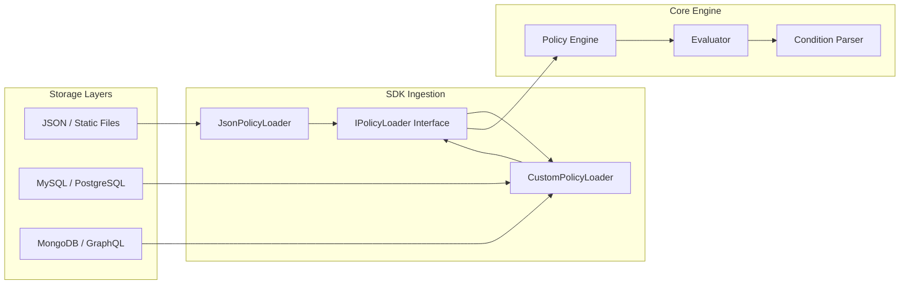

# Architectural Specification: EvoPolicy

This document provides a comprehensive technical analysis of the EvoPolicy SDK architecture, internal evaluation logic, and security design principles. It is intended for developers and security auditors requiring a deep understanding of the engine.

## 1. Unified Decision Model

EvoPolicy operates on a **Fail-Closed** security principle. Any ambiguity, missing context, or initialization failure results in an immediate denial of access. 

### Evaluation Priority (Deny-Overrides)
The decision logic follows a strictly ordered set of operations:
1.  **Candidate Selection**: Filters policy sets matching the `Subject.role`, `Action`, and `Resource.type`.
2.  **Explicit Deny Evaluation**: If any matching policy contains an `effect: 'deny'` and its conditions are validated as true, access is denied immediately.
3.  **Explicit Allow Evaluation**: If no deny matches are found, the engine checks for `effect: 'allow'`. If at least one matching policy is validated, access is granted.
4.  **Implicit Deny**: If no policies match or satisfy conditions, access is refused.

## 2. In-Process Condition Parsing

The engine includes a custom-built, non-evaluative recursive descent parser. This design avoids the security risks associated with standard JavaScript `eval()` or `new Function()` primitives.

### Context Transformation
During evaluation, the parser merges Subject and Resource contexts into a unified evaluation object. This allows for both flat-key and nested-path access (e.g., `subject.id` or `id`).

### Operational Logic
*   **Chronological Comparisons**: The parser automatically recognizes ISO-8601 date strings and performs unix-timestamp comparisons.
*   **Regular Expressions**: Secured pattern matching allows for complex attribute validation (e.g., email domains, ID structures).
*   **List Membership**: Optimized inclusion checks support both static and dynamic arrays.

## 3. Extensible Data Loading (Strategy Pattern)

EvoPolicy utilizes the Strategy Pattern for data ingestion, decoupling the engine from the persistence layer. 

## 4. Performance Optimization

*   **In-Memory Indexing**: Policies are indexed by Role and Resource Type upon ingestion, reducing the selection complexity from linear O(n) to approximately O(1).
*   **Stateless Execution**: The engine is purely functional during evaluation, making it highly compatible with modern serverless and edge computing architectures.
*   **Passive Resource Usage**: No active polling or persistent connections are maintained by the core engine.

## 5. Security Architecture

*   **Minimal Dependency Surface**: The core engine is built with zero external runtime dependencies (using Zod exclusively for ingestion validation), significantly reducing the supply chain attack surface.
*   **Context Isolation**: Data provided in the evaluation request is treated as read-only, preventing context manipulation during the authorization lifecycle.
*   **Deterministic Output**: For any given policy set and request context, the engine will always produce the same binary (Allow/Deny) result.
